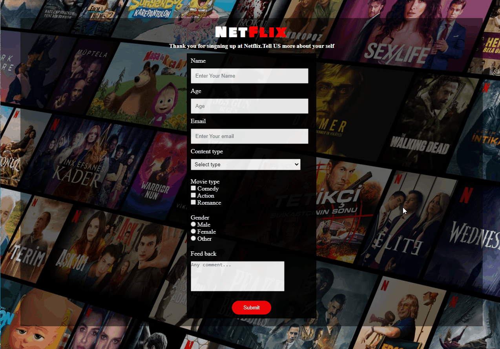

# NETFLIX PAGE {HTML + CSS}



## Description
This project aims to create a Netflix-like page.

## Project Skeleton 

```
NETFLIX_PAGE (folder)
|
|----README.md
|----img(folder)
    |----images and gifs
|----index.html
|----style.css
```

## What I used in this project?

- ## HTML
  - ### FORM
- ## CSS
  - ### DISPLAY INLINE-BLOCK

<left> ⌛ Happy Coding  💻🎶🍕🍀✍ </left>